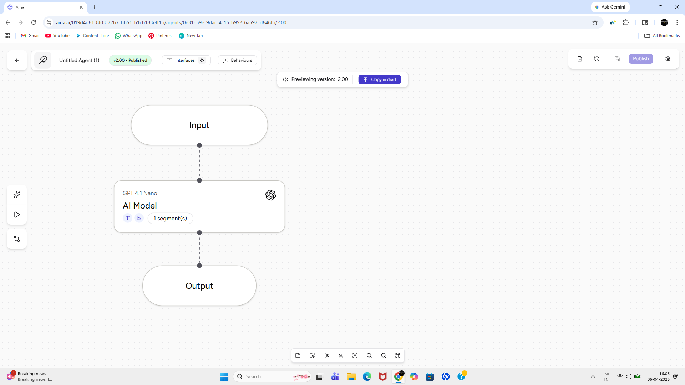
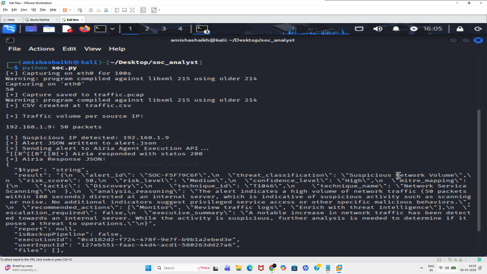
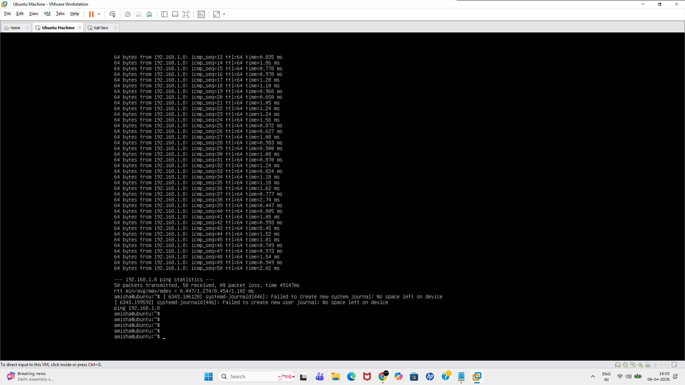

# 🚨 AI SOC Monitoring System (Tshark + Airia)

---

# 🔍 Overview:

This repository presents the steps and architecture for creating an Ai-based Security Operation Monitoring System for detecting suspicious network activity in real time.
The system captures live network traffic, processes packet data, identifies anomalous behavior based on traffic patterns, and forwards structured alerts to Airia AI for automated analysis and response.

---

# 🧾 Key Takeaways

 **Problem:** Lack of real-time visibility into network traffic makes it difficult to identify suspicious or high-volume activity manually. Traditional monitoring without automation can delay detection and response.

   **Solution:** Designed an AI-assisted SOC monitoring architecture that captures live traffic, analyzes packet patterns, detects anomalous IP behavior, and automates alert handling using Airia.

  **Outcome:** Enabled a streamlined pipeline for real-time detection and automated response, demonstrating how raw network data can be transformed into actionable security insights.

---

# 🎯 Objective:

* Monitor network traffic in real time
* Detect suspicious IP behavior using anomaly-based logic
* Generate structured alerts
* Enable automated SOC workflows via Airia integration

---

# 🧩 Components Required:

* 🖥️ Two Vms: Attacker (Ubuntu) and Target (Kali Linux)
* 🤖 Airia Agent
* 🐍 Python Script

---

# ⚙️ Step by Step Workflow:

## 1️⃣ Airia Agent Creation
 
* Sign-up into airia.ai and create a project under the project section.

  * Create a project and add your appropriate ai model using.
  * Publish the agent and get the API details.

---

## 2️⃣ Packet Capturing

* In this step we are going to run the python script created onto Kali Linux Vm.

* The Script contains various sections:

  * Configuration – Defines interface, target IP, thresholds, and file paths
  * Traffic Capture – Uses tshark to capture packets and store them as PCAP
  * Data Extraction – Converts PCAP data into CSV format
  * Traffic Analysis – Counts packets per source IP
  * Detection Engine – Flags IPs exceeding a defined threshold
  * Alert Generation – Creates a structured JSON alert
  * Integration Module – Sends alerts to Airia for automated processing

---

## 3️⃣ Traffic Generation

* In this step we are going to generate the traffic on Ubuntu Vm using:

  * `ping "IP_Address"` of Target machine i.e Kali Linux

---

## 4️⃣ Anomaly Detection

* If packet count from a source IP exceeds a predefined threshold

  * ➡️ The IP is flagged as suspicious

---

## 5️⃣ Alert Generation

* A structured alert is generated in JSON format containing:

  * Alert type
  * Indicator (IP address)
  * Evidence (packet count, time window)
  * Contextual metadata

---

## 6️⃣ Automated Response

* The alert is sent to Airia AI for:

  *  Automated analysis
  *  Decision support
  * Potential response orchestration

---

